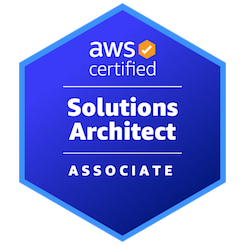
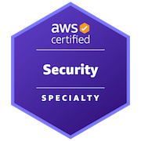

# # whoami
📖 Studying for Cloud & Security Engineer  
🔭 Towards for being SRE  
☕ Addicted in Caffeine  
🐱 Healing with watching animal  

## Tech Stack

  

  

  

## Certificate  

- AWS Certified Solutions Architect - Associate  
  
- AWS Certified Secutiry - Specialty  
    

## Award
- 2022 TS보안 허점을 찾아라! Excellence award (수목원)
- 2023 Sejong Hacktheon Grand award (LEWH)
- 2023 TS보안 허점을 찾아라! Grand award (수목원)
